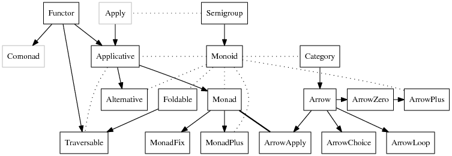

# Property-based testing

## Property-based testing

**Property-based testing** is about

> 1. Specifying your system under test in terms of properties, where properties describe invariants of the system based on its input and output.

> 2. Testing that those properties hold against a large variety of inputs.

. . .

--- Oskar Wickstrom, _Property-Based Testing in a Screencast Editor_

. . .

Has its roots in Haskell, but PBT is not specific to functional programming.

## Goals

We don't use property-based testing very much in our codebase, so hopefully by the end of this, we'll be able to:

> - Identify some common properties and how to test them

> - Get some familiarity with the `fast-check` API

## Example: algebraic properties

Proving basic algebraic laws for `xor` (`packages/monorail/src/sharedHelpers/fp-ts-ext/__tests__/Array.jest.ts`):

. . .

> - identity

> - inverse

> - associativity

> - _(pseudo-)_ commutativity

## Example: algebraic properties

Probably won't come up too often, but usually when defining type class instances for `Semigroup`, `Monoid`, `Functor`, `Applicative`, `Monad`, you might also want to test the corresponding type class laws.

(Or when defining optics, there are laws for those too!)

## Example: encoding and decoding

Already had an existing 
```typescript
formatBytes: (bytes: number) => string
```

. . .

but wanted to sort by number of bytes\pause, so needed

```typescript
parseBytes: (formatted: string) => Option<number>
```

. . .

(`src/catalog/attackDesigner/common/formatBytes.ts`)

## Combining `Arbitrary`s

In order to write custom 
```typescript
arbFormattedBytes: Arbitrary<string>
```
\pause I needed to combine 
```typescript
fc.nat: Arbitrary<number>
```
(natural numbers) \pause and 
```typescript
arbByteUnit: Arbitrary<ByteUnit>
```
(units such as "B", "KB", "MB", etc.).

. . .

I can combine a `number` and a `ByteUnit` to get a "formatted byte" by converting to string and using string concatenation, but how do I combine an `Arbitrary<number>` and an `Arbitrary<ByteUnit>`?

## Combining `Arbitrary`s

Normally we would use `sequenceT` and `map`
```typescript
pipe(
  sequenceT(Arb.arbitrary)(fc.nat(), arbByteUnit()),
  Arb.map(([nat, byteUnit]) => `${nat} ${byteUnit}`)
)
```

. . .

...but `Arbitrary` doesn't have an `Apply`/`Applicative` instance (so can't use with `sequenceT`) :sad-face:

. . .

...but there is a `chain`

## Type classes




## Example: reference implementation

A more general `Array.prototype.every` that works on _all_ `Foldable`s

(`packages/monorail/src/sharedHelpers/fp-ts-ext/__tests__/Foldable.jest.ts`)

## In summary

Summary of common scenarios I've come across:

- Testing some thing with obvious algebraic properties

- Encoding/decoding (or parsing/formatting)

- Reference implementation (oracle)

More examples here:

- [Choosing properties for property-based testing (Scott Wlaschin)](https://fsharpforfunandprofit.com/posts/property-based-testing-2/)

## GSM-7: A case study

Text encoding for SMS that packs a 7-bit character set into 8-bit bytes (so a 140-byte text message can contain 160 characters)

Wikipedia page: https://en.wikipedia.org/wiki/GSM_03.38

An encoding/decoding pair fails _rarely_, and there is no solution for it

## More resources

### Videos

- [Code Checking Automation - Computerphile](https://www.youtube.com/watch?v=AfaNEebCDos) (with John Hughes, author of `QuickCheck`, and uses the GSM-7 encoding as an example)

- [The Magic of Generative Testing: Fast-Check in JavaScript](https://www.youtube.com/watch?v=a2J_FSkxWKo) (lightning talk by Gabriel Lebec, more introductory material)

- [Property-Based Testing for Better Code (Jessica Kerr)](https://www.youtube.com/watch?v=shngiiBfD80)

### Articles

- [Choosing properties for property-based testing (Scott Wlaschin)](https://fsharpforfunandprofit.com/posts/property-based-testing-2/)

